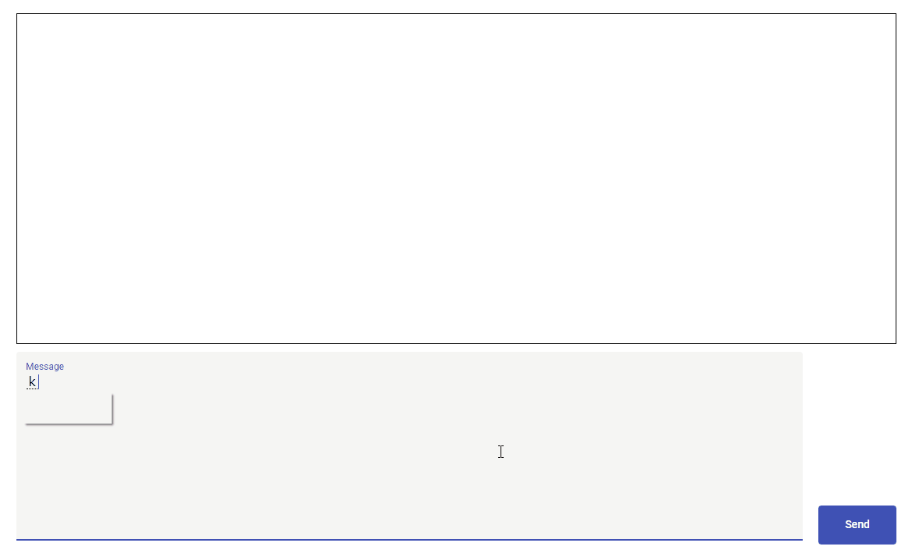

# 概要
GolangのWebSocketを勉強するために作ったチャットアプリです。

## Backend
- 言語：Golang
- Websocketライブラリ：gorilla/websocket

## Frontend
- 言語：HTML,SCSS,Typescript
- フレームワーク：Angular
- UIライブラリ：AngularMaterial

## 動作イメージ
 

## 実行コンテナ
`cotta0322/sample-golang-websocket:0.0.1`

### コンテナ実行サンプルCMD
`docker run -p 8080:8080 cotta0322/sample-golang-websocket:0.0.1`

これでブラウザで[http://localhost:8080/](ttp://localhost:8080/)にアクセスすると実行できます。